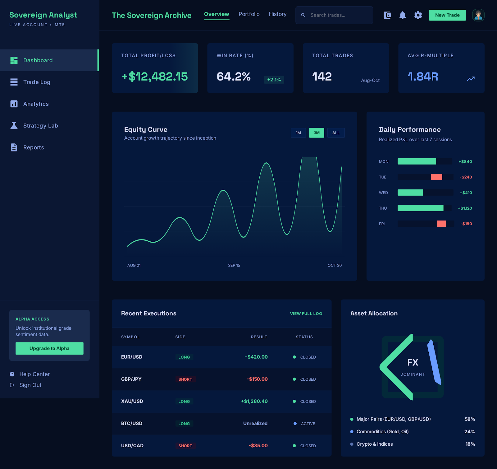

# Sovereign Trading Journal

A professional, native macOS trading journal built for the "Sovereign Analyst". This application provides a high-contrast, data-dense environment to log trades, manage multiple accounts, and track performance with absolute precision.



## 💎 Design Philosophy: "Sovereign Analyst"
- **Deep Sea Dark Mode**: Optimized for long analysis sessions with a curated midnight palette.
- **Tonal Layering**: Clear visual hierarchy without distracting borders.
- **Precision Typography**: Utilizing Inter and monospaced digits for tabular data alignment.
- **Glassmorphism**: Subtle translucency in modals and overlays for a premium native feel.

## 🚀 Core Features

### 📊 Performance Analytics
- **Equity Curve**: Visualized with a signature glow stroke and gradient fill.
- **KPI Metrics**: Real-time calculation of Win Rate, Profit Factor, Avg R-Multiple, and Total Return.
- **Zebra-Striped Log**: Clean, spacing-optimized trade history with tonal alternating rows.

### 📝 Advanced Trade Logging
- **Dual Screenshots**: Attach both Entry/Context and Exit/Result charts to every trade.
- **Interactive Image Viewer**: Inspect your charts in full-screen with a single click.
- **Manual Overrides**: Calculate P&L automatically via price or override with exact manual currency values.
- **Time-Travel Logging**: Manually enter or adjust entry and exit timestamps.

### 💼 Portfolio Management
- **Multiple Accounts**: Manage separate journals for FTMO, Personal, and Broker accounts.
- **SwiftData Persistence**: Native SQLite storage managed by macOS for blazingly fast queries.
- **External Image Storage**: Heavy image data is offloaded from the main database to keep the app lightweight.

### 🛡️ Automated Backups
- **Daily Snapshots**: The app automatically creates a date-stamped backup of your SQLite database in your Documents folder on every first launch of the day.
- **30-Day Retention**: Keeps a rolling 30-day history of your journal snapshots.

## 🛠 Tech Stack
- **Framework**: SwiftUI (macOS 14.0+)
- **Persistence**: SwiftData (SQLite)
- **Project Management**: [XcodeGen](https://github.com/yonaskolb/XcodeGen)
- **Styling**: Vanilla SwiftUI with custom Theme extensions.

## 🏗 Setup & Installation

### Prerequisites
- macOS 14.0 or later.
- Xcode 15.0 or later.
- [XcodeGen](https://github.com/yonaskolb/XcodeGen) installed (`brew install xcodegen`).

### Building from Source
1. Clone the repository:
   ```bash
   git clone https://github.com/dzintars2/trading-journal.git
   cd trading-journal/TradingJournalApp
   ```
2. Generate the Xcode project:
   ```bash
   xcodegen
   ```
3. Open the project:
   ```bash
   open TradingJournalApp.xcodeproj
   ```
4. Press `Cmd + R` in Xcode to build and run.

---
*Built for traders who value data sovereignty and aesthetic excellence.*
